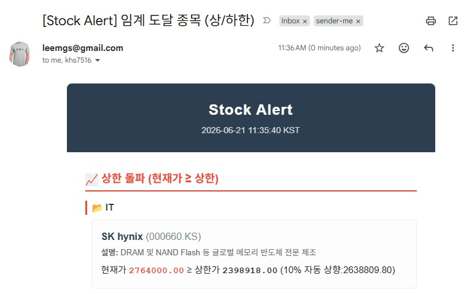

---

# 📈 Stock Alert – Multi-Market Price Monitor

**자동 주식 임계가(상한/하한) 감시 및 이메일·Slack 알림 시스템**



본 프로젝트는

* 국내(KOSPI/KOSDAQ) 및 해외(NASDAQ/NYSE/HK/VN 등) 주요 종목의 실시간 가격을 감시하고,
* 지정된 임계값(`price_down`, `price_up`)을 넘거나 내려갈 때
  **자동으로 이메일과 Slack 채널로 알림**을 전송합니다.
* 또한 **주간 리포트** 및 **GitHub Actions 기반 서버리스 실행**을 지원합니다.

---

## 1. 🚀 주요 기능

| 기능                     | 설명                                                   |
| ---------------------- | ---------------------------------------------------- |
| **가격 모니터링**            | Yahoo Finance API(`yfinance`)를 통해 종목별 실시간 시세 수집      |
| **임계가 알림**             | 하한(`price_down`) 이하 또는 상한(`price_up`) 이상일 때 메일/슬랙 발송 |
| **Rate-Limit 제어**      | 하루 종목당 최대 알림 횟수, 최소 알림 간격, 글로벌 알림 캡 제한               |
| **Slack 알림 전송**     | 임계가 도달 시 전용 채널로 실시간 알림 전송            |
| **주간 리포트**             | 주 1회 Slack 리포트 자동 발송 (지난 7일 상/하한 기록 요약)              |
| **장중 실행 제한**           | 장중(예: 09:00~15:30) 시간대만 알림 수행                        |
| **GitHub Actions 자동화** | 별도 서버 없이 1시간마다/주 1회 GitHub Actions로 자동 실행 가능         |
| **임계값 자동 업데이트**      | 알림 발생 시 상한가는 10% 상향, 하한가는 10% 하향하여 자동 업데이트 및 깃허브 반영 |

---

## 2. 📦 프로젝트 구조

```
stock-alert/
├── LICENSE
├── README.md
├── requirements.txt
├── data/
│   └── stock.txt
├── src/
│   ├── multi_stock_alert.py
│   ├── weekly_report.py
│   └── run.sh
└── .github/
    └── workflows/
        ├── stock-daily-report.yml     # 1시간마다 자동 알림
        └── stock-weekly-report.yml # 주간 리포트 (매주 토요일 9시)
```

---

## 3. ⚙️ 설치 및 실행 (로컬 / 서버 환경)

```bash
# 1. 저장소 클론 및 이동
cd /opt/
git clone https://github.com/leemgs/stock-alert.git
cd stock-alert

# 2. 의존성 설치
pip install -r requirements.txt

# 3. 주식 임계값 파일 작성
vi data/stock.txt

# 4. 환경 변수 세팅 후 테스트 실행
export SMTP_HOST=smtp.gmail.com
export SMTP_USER=your_email@gmail.com
export SMTP_PASS=your_app_password
export EMAIL_TO="you@company.com, team@company.com"
python src/multi_stock_alert.py

# 5. 크론 등록 (1시간마다)
0 */1 * * * /opt/stock-alert/src/run.sh
```

---

## 4. 📄 예시 설정

### `stock.txt`

```csv
loc, company_name, ticker, price_down, price_up
국내, Samsung Electronics, 005930.KS, 60000, 90000
국내, SK hynix, 000660.KS, 140000, 220000
미국, Nvidia, NVDA, 400, 1200
미국, Tesla, TSLA, 150, 350
```

### 환경 변수 (Environment Variables)

기존 `config.txt` 대신 **환경 변수**를 통해 설정을 주입합니다.
로컬 실행 시에는 `.env.example` 파일을 참고하여 `export`로 환경 변수를 적용하시고, GitHub Actions 실행 시에는 **Repository Secrets/Variables**에 등록하여 사용하세요.
*(https://github.com/leemgs/stock-alert/settings/secrets/actions 참고)*

자세한 환경 변수 목록과 설명은 [`.env.example`](.env.example) 파일을 확인해 주세요.

---

## 5. ☁️ GitHub Actions 서버리스 자동화

이 프로젝트는 별도 서버 없이 GitHub Actions로 자동 실행할 수 있습니다.
레포에 포함된 워크플로 파일:

* `.github/workflows/stock-daily-report.yml` → **1시간마다 자동 알림 (상/하한 돌파)**
* `.github/workflows/stock-weekly-report.yml` → **매주 토요일 09:00 KST 주간 동향 리포트**

### 1️⃣ Secrets 및 Variables 등록 (Settings → Secrets and variables → Actions)

보안이 필요한 암호화된 정보는 **Secrets**에, 그 외의 일반적인 설정 정보는 **Variables**에 등록하는 것을 권장합니다. (단, 기존처럼 모두 Secrets에 등록해도 무방합니다.)

#### 🔒 Repository Secrets (보안 정보)
| Key | 필수여부 | 기본값(Default) | 설명 |
| --- | --- | --- | --- |
| `SMTP_PASS` | 필수 | (없음) | 이메일 발송용 SMTP 앱 비밀번호 |
| `SLACK_WEBHOOK_URL` | 선택 | (없음) | Slack 웹훅 URL |

#### ⚙️ Repository Variables (일반 설정 정보)
| Key | 필수여부 | 기본값(Default) | 설명 |
| --- | --- | --- | --- |
| `SMTP_HOST` | 필수 | (없음) | 발송용 이메일 서버 (예: `smtp.gmail.com`) |
| `SMTP_PORT` | 선택 | `587` | 발송용 이메일 포트 번호 |
| `SMTP_USER` | 필수 | (없음) | 발송용 이메일 계정 ID |
| `EMAIL_FROM` | 선택 | `SMTP_USER`와 동일 | 알림 발신자 주소 |
| `EMAIL_TO` | 선택 | `root@localhost` | 알림 수신자 주소 (여러 명일 경우 쉼표 `,` 로 구분) |
| `UPDATE_THRESHOLD_DOWN_PERCENT`| 선택 | `10` | 하한가 자동 하향 폭 (%) |
| `UPDATE_THRESHOLD_UP_PERCENT` | 선택 | `10` | 상한가 자동 상향 폭 (%) |
| `ALERT_RATE_LIMIT_PER_TICKER_PER_DAY` | 선택 | `2` | 1일 1종목 최대 알림 발생 제한 횟수 |
| `ALERT_MIN_INTERVAL_MINUTES` | 선택 | `60` | 동일 종목 최소 알림 간격 (분) |
| `ALERT_GLOBAL_DAILY_CAP` | 선택 | `100` | 전체 종목 합산 1일 최대 알림 횟수 |
| `ACTIVE_START` | 선택 | `00:00` | 활성 시작 시간 (`HH:MM`) |
| `ACTIVE_END` | 선택 | `23:59` | 활성 종료 시간 (`HH:MM`) |
| `ACTIVE_BUSINESS_DAYS_ONLY` | 선택 | `false` | 평일(월~금)에만 알림 활성화 여부 (`true`/`false`) |


### 2️⃣ 워크플로 실행 확인

```bash
# 수동 트리거
gh workflow run "Daily Stock Report (1-hour)"
gh workflow run "Weekly Stock Report (Saturday 9 AM)"
```

### 3️⃣ 실행 주기 (UTC 기준)

* 알림: `0 */1 * * *` → 1시간마다
* 리포트: `0 0 * * 6` → 매주 토요일 09:00 (KST)

---

## 6. 🔄 임계값 자동 업데이트 및 깃허브 반영

알림이 발생하면 다음 단계의 모니터링을 위해 임계값이 자동으로 조정됩니다.

1.  **임계값 자동 조정**:
    *   **상한 돌파 시**: 현재 상한가(`price_up`)에서 **10% 상향**된 금액으로 업데이트
    *   **하한 돌파 시**: 현재 하한가(`price_down`)에서 **10% 하향**된 금액으로 업데이트
2.  **깃허브 자동 반영**:
    *   수정된 `stock.txt` 파일은 GitHub Actions 워크플로우를 통해 자동으로 **commit 및 push**되어 레포지토리에 반영됩니다.
    *   이를 통해 별도의 수동 수정 없이도 지속적인 가격 추적 및 단계별 알림이 가능합니다.

---

## 7. 📊 알림 예시

### 이메일 (Premium HTML)

본 시스템은 가독성이 뛰어난 HTML 형식을 지원합니다.
- **상한 돌파**: 강렬한 빨간색 카드로 강조
- **하한 돌파**: 신중한 파란색 카드로 강조
- **반응형 디자인**: 모바일 및 데스크톱 이메일 클라이언트 최적화


```text
Subject: [Stock Alert] 임계 도달 종목 (상/하한)
```

### Slack (#wins)

> :small_red_triangle: **상한 돌파**
>
> * *Nvidia* `NVDA`: `1250 ≥ 1200`

### Slack (#risk)

> :small_red_triangle_down: **하한 돌파**
>
> * *KakaoBank* `323410.KS`: `23,800 ≤ 25,000`

---

## 8. 📆 주간 리포트 예시 (Premium HTML)

주간 리포트는 한눈에 들어오는 요약 표와 통계 그리드를 제공합니다.

```text
[Weekly Summary Report]
- 기간: 2025-10-13 ~ 2025-10-20
- 총 알림: 12건 (상 7 / 하 5)
- 종목별 발생 횟수 데이터 테이블 포함
```

---

## 9. 🧩 GitHub Actions YAML

| 파일명                            | 설명                                          |
| ------------------------------ | ------------------------------------------- |
| `.github/workflows/stock-daily-report.yml` | 1시간마다 주식 가격 알림 실행                           |
| `.github/workflows/stock-weekly-report.yml` | 매주 토요일 09시(KST) 주간 리포트 생성                   |
| **GitHub Secrets**             | 민감정보(SMTP, Slack Webhook 등)는 Secrets를 통해 주입 |

> Actions 러너는 매 실행마다 초기화되므로,
> `history.json` 보존에는 `actions/cache` 또는 외부 스토리지(S3, Redis 등) 연동을 권장합니다.

---

## 10. 사용 상황별 추천

* 히스토리컬 주가(일별)만 필요할 때 → yfinance 혹은 pandas-datareader
* 실시간 혹은 분단위 데이터 + 기술지표까지 필요할 때 → alpha_vantage
* 국내/해외 다양한 시장(주식, ETF, 지수 등)에서 범용적 데이터 필요할 때 → investpy
* 간단하게 현재가만 빠르게 조회할 때 → stockquotes


## 11. 🧠 Credits

* Developed by [Geunsik Lim](https://github.com/leemgs)
* Powered by **Python 3.11 + GitHub Actions + Yahoo Finance API**


## 12. Reference
* https://comp.wisereport.co.kr/company/c1070001.aspx?cmp_cd=005930&cn (삼성 임원 주식 보유현황)
* https://pypi.org/project/yfinance/ (Yahoo Finance 파이썬 라이브러리)
  - Ticker (22310.KQ)으로 조회 - https://finance.yahoo.com/quote/223310.KQ/

---
