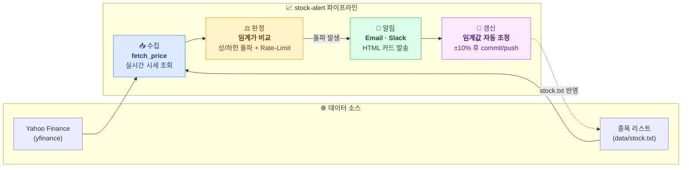
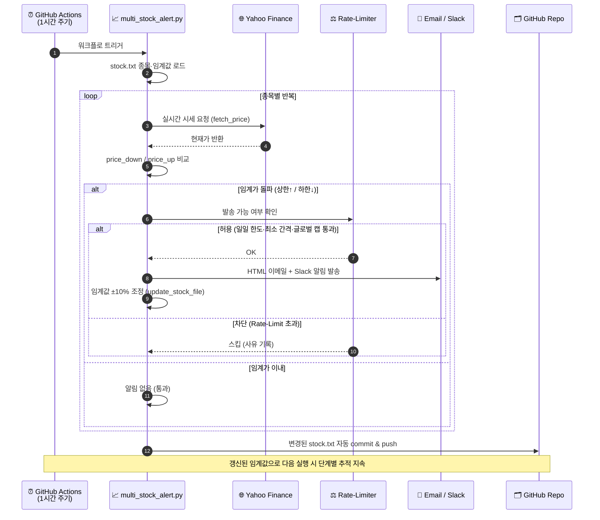

---

# 📈 Stock Alert – Multi-Market Price Monitor

**자동 주식 임계가(상한/하한) 감시 및 이메일·Slack 알림 시스템**

본 프로젝트는

* 국내(KOSPI/KOSDAQ) 및 해외(NASDAQ/NYSE/HK/VN 등) 주요 종목의 실시간 가격을 감시하고,
* 지정된 임계값(`price_down`, `price_up`)을 넘거나 내려갈 때
  **자동으로 이메일과 Slack 채널로 알림**을 전송합니다.
* 또한 **주간 리포트** 및 **GitHub Actions 기반 서버리스 실행**을 지원합니다.

---

## 🔎 한눈에 보기 (At a Glance)

별도 서버 없이 **GitHub Actions**만으로 동작하는 서버리스 주가 감시 파이프라인입니다.
아래 한 장의 그림으로 전체 구조를 파악할 수 있습니다.



| 단계 | 구성 요소 | 한 줄 설명 |
| --- | --- | --- |
| 📥 **수집** | `src/multi_stock_alert.py` · `yfinance` | `data/stock.txt`의 종목별 실시간 시세를 조회 |
| ⚖️ **판정** | 임계가 비교 · Rate-Limit | 하한(`price_down`)/상한(`price_up`) 돌파 여부 판정 및 알림 횟수 제어 |
| 📢 **알림** | `send_email` · `post_slack` | 돌파 시 HTML 이메일과 Slack 채널(#wins/#risk)로 즉시 발송 |
| 🔄 **갱신** | `update_stock_file` · GitHub Actions | 상한 +10% / 하한 −10% 조정 후 `stock.txt`를 자동 commit·push |
| 📆 **리포트** | `src/stock_weekly_report.py` | 매주 토요일 지난 7일 등락률을 요약해 주간 리포트 발송 |

> **핵심 원칙:** *감지는 매시간 자동, 임계값 갱신은 알림 발생 시에만.* 별도 인프라 없이 GitHub Actions 러너에서 전 과정이 완결됩니다.

---

## 🔄 동작 흐름도 (Operation Flow)

알림 1회 실행(매시간) 시 데이터가 흐르는 전체 순서입니다.



**흐름 요약**

1. **트리거**: GitHub Actions가 1시간마다(`0 */1 * * *`) 워크플로를 실행합니다.
2. **로드**: `data/stock.txt`에서 종목·카테고리·임계값(`price_down`/`price_up`)을 읽어옵니다.
3. **수집·판정**: 종목별로 `yfinance` 실시간 시세를 받아 상/하한 돌파 여부를 비교합니다.
4. **Rate-Limit**: 종목당 일일 최대 횟수, 최소 발송 간격, 글로벌 캡을 확인해 과도한 알림을 억제합니다.
5. **알림**: 돌파가 허용되면 HTML 이메일과 Slack(#wins/#risk) 채널로 발송합니다.
6. **자동 갱신**: 돌파한 임계값을 ±10% 조정하고, 변경된 `stock.txt`를 저장소에 자동 commit·push합니다.

---

## 1. 🚀 주요 기능

| 기능                     | 설명                                                   |
| ---------------------- | ---------------------------------------------------- |
| **가격 모니터링**            | Yahoo Finance API(`yfinance`)를 통해 종목별 실시간 시세 수집      |
| **임계가 알림**             | 하한(`price_down`) 이하 또는 상한(`price_up`) 이상일 때 메일/슬랙 발송 |
| **Rate-Limit 제어**      | 하루 종목당 최대 알림 횟수, 최소 알림 간격, 글로벌 알림 캡 제한               |
| **Slack 알림 전송**     | 임계가 도달 시 전용 채널로 실시간 알림 전송            |
| **주간 리포트**             | 주 1회 Slack 리포트 자동 발송 (지난 7일 상/하한 기록 요약)              |
| **GitHub Actions 자동화** | 별도 서버 없이 1시간마다/주 1회 GitHub Actions로 자동 실행 가능         |
| **임계값 자동 업데이트**      | 알림 발생 시 상한가는 10% 상향, 하한가는 10% 하향하여 자동 업데이트 및 깃허브 반영 |

---

## 2. 📦 프로젝트 구조

```
stock-alert/
├── LICENSE
├── README.md
├── requirements.txt
├── data/
│   └── stock.txt
├── src/
│   ├── multi_stock_alert.py
│   ├── weekly_report.py
│   └── run.sh
└── .github/
    └── workflows/
        ├── stock-daily-report.yml     # 1시간마다 자동 알림
        └── stock-weekly-report.yml # 주간 리포트 (매주 토요일 9시)
```

---

## 3. ⚙️ 설치 및 실행 (로컬 / 서버 환경)

```bash
# 1. 저장소 클론 및 이동
cd /opt/
git clone https://github.com/leemgs/stock-alert.git
cd stock-alert

# 2. 의존성 설치
pip install -r requirements.txt

# 3. 주식 임계값 파일 작성
vi data/stock.txt

# 4. 이메일 설정 및 실행 테스트
# (1) data/email.json 파일에 이메일 정보 설정 (아래 4.1 참고)
# (2) SMTP 비밀번호 환경변수 설정 후 실행
export SMTP_PASS=your_app_password
python src/multi_stock_alert.py

# 5. 크론 등록 (1시간마다)
0 */1 * * * /opt/stock-alert/src/run.sh
```

---

## 4. 📄 예시 설정

### `stock.txt`

이메일/Slack 감시 및 카테고리 분류를 위해 종목 리스트를 `./data/stock.txt`에 작성합니다. 첫 번째 컬럼(`domain`)에는 종목의 분류(AI, SW, IT, 로봇, 전력, 농업, 건설, 바이오, 기타 등)를 작성합니다.

```csv
domain, company_name, ticker, price_down, price_up, description
AI, Alphabet Inc. Class C, GOOG, 260.00, 420.00, 구글 검색/안드로이드/유튜브 및 AI 연구(DeepMind)
SW, Microsoft, MSFT, 300.00, 600.00, OS(Windows)/클라우드(Azure)/오피스 소프트웨어 및 생성형 AI(Copilot)
IT, Samsung Electronics, 005930.KS, 60000.00, 384326.25, 메모리 반도체/스마트폰/디스플레이 및 가전 글로벌 선도 기업
로봇, 두산로보틱스, 454910.KS, 88000.00, 132000.00, 협동로봇 - 글로벌 최고 수준의 협동로봇 및 스마트 팩토리 자동화 솔루션
```

### `email.json` (이메일 설정 파일)

유지보수 및 운영 편의성을 위해 민감정보인 `SMTP_PASS`를 제외한 나머지 이메일/SMTP 설정은 `./data/email.json` 파일에서 관리합니다.

```json
{
  "_comment": "receiver의 이메일 주소는 회사 이메일의 경우에 회사 방화벽에서 이메일의 수신자체를 막거나, 스팸함으로 분류되는 경우가 많습니다.",
  "smtp_host": "smtp.gmail.com",
  "smtp_port": 587,
  "smtp_user": "leemgs@gmail.com",
  "sender": "leemgs@gmail.com",
  "receivers": [
    "leemgs@gmail.com",
    "khs7516@gmail.com"
  ]
}
```

### 환경 변수 및 GitHub Secrets

* **`SMTP_PASS`**: 보안 유지를 위해 환경변수(로컬 실행 시) 또는 **GitHub Secrets**(GitHub Actions 실행 시)로 설정합니다.
* **`SLACK_WEBHOOK_URL`**: Slack 알림 연동을 원할 경우 환경변수 또는 **GitHub Secrets**에 등록하여 사용합니다.

---

## 5. ☁️ GitHub Actions 서버리스 자동화

이 프로젝트는 별도 서버 없이 GitHub Actions로 자동 실행할 수 있습니다.
레포에 포함된 워크플로 파일:

* `.github/workflows/stock-daily-report.yml` → **1시간마다 자동 알림 (상/하한 돌파)**
* `.github/workflows/stock-weekly-report.yml` → **매주 토요일 09:00 KST 주간 동향 리포트**

### 1️⃣ Secrets 및 Variables 등록 (Settings → Secrets and variables → Actions)

이메일 설정을 `./data/email.json` 파일에서 관리하게 됨으로써, GitHub 설정에서는 **`SMTP_PASS`** (이메일 비밀번호) 및 **`SLACK_WEBHOOK_URL`** 만 **Repository Secrets**에 등록하시면 됩니다.

#### 🔒 Repository Secrets (보안 정보)
| Key | 필수여부 | 기본값(Default) | 설명 |
| --- | --- | --- | --- |
| `SMTP_PASS` | 필수 | (없음) | 이메일 발송용 SMTP 앱 비밀번호 |
| `SLACK_WEBHOOK_URL` | 선택 | (없음) | Slack 웹훅 URL |

#### ⚙️ Repository Variables (일반 설정 정보)
| Key | 필수여부 | 기본값(Default) | 설명 |
| --- | --- | --- | --- |
| `UPDATE_THRESHOLD_DOWN_PERCENT`| 선택 | `10` | 하한가 자동 하향 폭 (%) |
| `UPDATE_THRESHOLD_UP_PERCENT` | 선택 | `10` | 상한가 자동 상향 폭 (%) |

### 2️⃣ 워크플로 실행 확인

```bash
# 수동 트리거
gh workflow run "Daily Stock Report (1-hour)"
gh workflow run "Weekly Stock Report (Saturday 9 AM)"
```

### 3️⃣ 실행 주기 (UTC 기준)

* 알림: `0 */1 * * *` → 1시간마다
* 리포트: `0 0 * * 6` → 매주 토요일 09:00 (KST)

---

## 6. 🔄 임계값 자동 업데이트 및 깃허브 반영

알림이 발생하면 다음 단계의 모니터링을 위해 임계값이 자동으로 조정됩니다.

1.  **임계값 자동 조정**:
    *   **상한 돌파 시**: 현재 상한가(`price_up`)에서 **10% 상향**된 금액으로 업데이트
    *   **하한 돌파 시**: 현재 하한가(`price_down`)에서 **10% 하향**된 금액으로 업데이트
2.  **깃허브 자동 반영**:
    *   수정된 `stock.txt` 파일은 GitHub Actions 워크플로우를 통해 자동으로 **commit 및 push**되어 레포지토리에 반영됩니다.
    *   이를 통해 별도의 수동 수정 없이도 지속적인 가격 추적 및 단계별 알림이 가능합니다.

---

## 7. 📊 알림 예시

### 이메일 (Premium HTML)

본 시스템은 가독성이 뛰어난 HTML 형식을 지원합니다.
- **상한 돌파**: 강렬한 빨간색 카드로 강조
- **하한 돌파**: 신중한 파란색 카드로 강조
- **반응형 디자인**: 모바일 및 데스크톱 이메일 클라이언트 최적화


```text
Subject: [Stock Alert] 임계 도달 종목 (상/하한)
```

### Slack (#wins)

> :small_red_triangle: **상한 돌파**
>
> * *Nvidia* `NVDA`: `1250 ≥ 1200`

### Slack (#risk)

> :small_red_triangle_down: **하한 돌파**
>
> * *KakaoBank* `323410.KS`: `23,800 ≤ 25,000`

---

## 8. 📆 주간 리포트 예시 (Premium HTML)

주간 리포트는 한눈에 들어오는 요약 표와 통계 그리드를 제공합니다.

```text
[Weekly Summary Report]
- 기간: 2025-10-13 ~ 2025-10-20
- 총 알림: 12건 (상 7 / 하 5)
- 종목별 발생 횟수 데이터 테이블 포함
```

### 🔍 주간 증감 추이 계산 방식

주간 리포트에 표시되는 증감 추이 수치는 로컬 로그 파일에 의존하지 않고, 리포트 생성 시점에 실시간으로 시장 데이터를 조회하여 산출됩니다.

1. **데이터 수집**: `yfinance` API(`history(period="5d")`)를 호출하여 각 종목의 최근 5영업일(1주일) 주가 이력을 실시간으로 불러옵니다.
2. **비교 기준**: 불러온 데이터 중 **첫 번째 날의 종가(시작가)**와 **마지막 날의 종가(현재가)**를 추출합니다.
3. **등락률 계산**: `((현재가 - 시작가) / 시작가) * 100` 공식을 적용하여 해당 주간의 정확한 퍼센트(%) 등락률을 계산하고 리포트에 반영합니다.

---

## 9. 🧩 GitHub Actions YAML

| 파일명                            | 설명                                          |
| ------------------------------ | ------------------------------------------- |
| `.github/workflows/stock-daily-report.yml` | 1시간마다 주식 가격 알림 실행                           |
| `.github/workflows/stock-weekly-report.yml` | 매주 토요일 09시(KST) 주간 리포트 생성                   |
| **GitHub Secrets**             | 민감정보(SMTP, Slack Webhook 등)는 Secrets를 통해 주입 |

> Actions 러너는 매 실행마다 초기화되므로,
> `history.json` 보존에는 `actions/cache` 또는 외부 스토리지(S3, Redis 등) 연동을 권장합니다.

---

## 10. 사용 상황별 추천

* 히스토리컬 주가(일별)만 필요할 때 → yfinance 혹은 pandas-datareader
* 실시간 혹은 분단위 데이터 + 기술지표까지 필요할 때 → alpha_vantage
* 국내/해외 다양한 시장(주식, ETF, 지수 등)에서 범용적 데이터 필요할 때 → investpy
* 간단하게 현재가만 빠르게 조회할 때 → stockquotes


## 11. 🧠 Credits

* Developed by [Geunsik Lim](https://github.com/leemgs)
* Powered by **Python 3.11 + GitHub Actions + Yahoo Finance API**


## 12. Reference
* https://comp.wisereport.co.kr/company/c1070001.aspx?cmp_cd=005930&cn (삼성 임원 주식 보유현황)
* https://pypi.org/project/yfinance/ (Yahoo Finance 파이썬 라이브러리)
  - Ticker (22310.KQ)으로 조회 - https://finance.yahoo.com/quote/223310.KQ/

---
